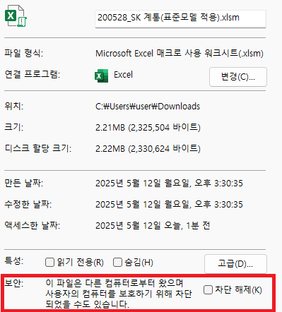
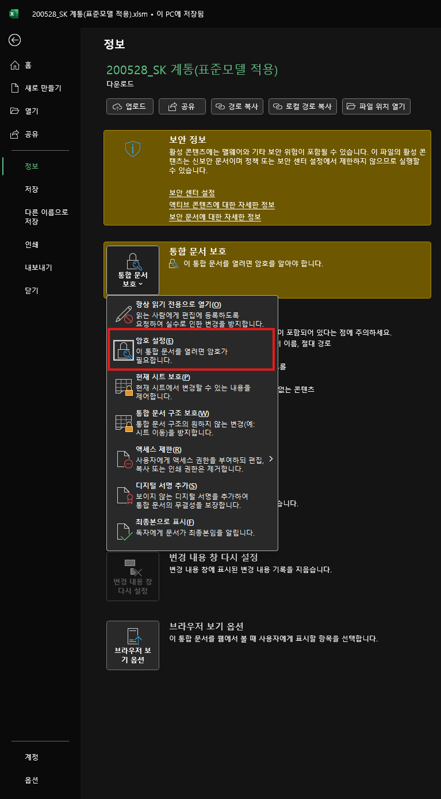
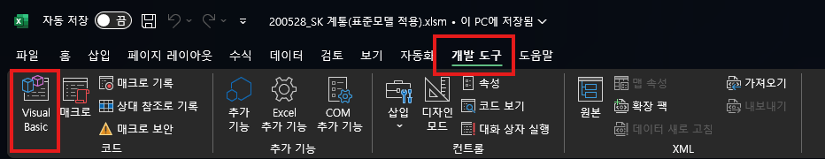
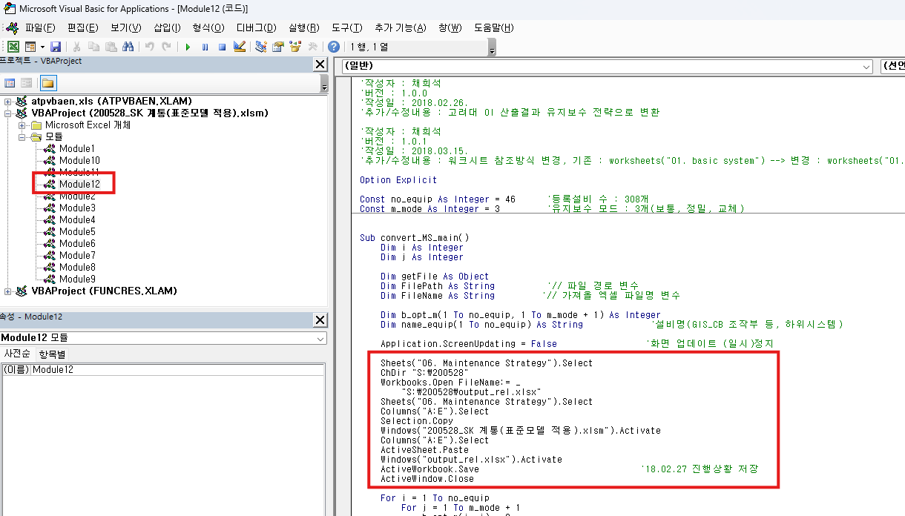

# Maintenance Strategy Optimizer


## 개요

특정 시스템의 합리적인 유지보수전략을 도출하기 위한 프로젝트이며, Multi-Value Knapsack문제를 풀이하는 툴입니다.
일반적인 Dynamic Programming, Genetic Algorithm, Duel Annealing, Ortools를 이용한 SCIP와 CP-SAT를 이용한 풀이방법을 제공합니다.

## 설치

이 프로젝트는 파이썬 `3.13`에서 제작되었습니다. `3.12` 이전 버전에서는 사용되지 않는 문법인 `f-string` floating point formatting을 사용하므로, 작동하지 않습니다.

### 윈도우의 경우

`start.bat`파일을 실행하여 가상환경을 생성하고, 필요한 패키지를 설치합니다.

이후에는 아래 명령어를 통해 가상환경을 활성화합니다.

#### 일반적인 cmd에서는 아래의 명령어로 실행
```bash
.\venv\Scripts\activate.bat
```

#### PowerShell에서는 아래의 명령어로 실행
```bash
.\venv\Scripts\Activate.ps1
```

#### 가상환경이 실행되지 않는 경우 global 환경에 패키지를 설치 및 실행
```angular2html
pip install -r requirements.txt
```

### 리눅스의 경우

`start.sh`파일을 실행하여 가상환경을 생성하고, 필요한 패키지를 설치합니다.

이후에는 아래 명령어를 통해 가상환경을 활성화합니다.

```bash
source venv/bin/activate
```

## 코드 자체에 대한 튜토리얼

자세한 튜토리얼은 `exp.ipynb`을 참고하세요 해당 프로젝트가 어떻게 수행되는지, 어떻게 구현되었는지에 대한 튜토리얼을 제공합니다. 문제 불러오기, 최적화문제 생성 및 풀이, 결과물 출력까지의 과정을 설명합니다.

## 프로그램 사용법

이 프로그램은 엑셀로부터 최적화문제를 읽어 OR-Tools를 이용하여 해결한 후 결과물을 엑셀로 출력합니다.
`data/data.xlsx`를 통해 예제를 확인하십시오. `config.py`파일을 통해 문제, solver, 엑셀파일의 경로를 설정할 수 있습니다.

다른 설정을 원하신다면 `config.py`파일을 수정하여 사용하시면 됩니다. 기본 설정은 효성중공업의 실제 문제를 불러오고 문제를 풀이합니다. 단 실제 문제를 담은 엑셀파일은 보안상의 문제로 제공하지 않습니다. 
예제 문제를 사용하고 싶다면, `main.py`파일의 두 번째 line을 아래와 같이 변경하여 다른 문제를 불러오도록 하십시오.

```python
# ./main.py

# from config import DEFAULT_CONFIG
# 위 부분을 아래와 같이 수정하여 다른 문제로 설정하도록 수정
from config_demo import DEFAULT_CONFIG
```

## 효성의 실제 문제를 사용하고 싶다면

`200528_SK계통(표준모델 적용).xlsm` 을 기준으로 설명합니다. 이 파일은 효성중공업의 실제 문제를 담고 있습니다. 이 파일을 사용하기 위해서는 아래의 과정을 거쳐야 합니다.

### 1. 엑셀파일의 비밀번호 제거 및 

효성의 시뮬레이터를 다운로드한 후 해당 파일을 우클릭 -> [속성] -> [보안] -> 차단해제 체크



엑셀파일을 열어 비밀번호를 제거합니다. 비밀번호를 제거한 후에는 엑셀파일을 다시 저장합니다.



이후 암호를 공백으로 설정합니다.
### 2. 매크로 수정
[개발 도구]-> [Visual Basic] -> [VBAProject(200528_SK계통(표준모델 적용).xlsm)]을 클릭하여 매크로를 수정합니다.



Module12를 수정하십시오, 실제 파일은 어디에 존재하는지 절대경로로 지정하십시오.



```vba
ChDir "S:\200528"
Workbooks.Open Filename:= _
    "S:\200528\output_rel.xlsx"   
```

위 부분을 실제 output_rel.xlsx파일이 존재하는 경로로 수정합니다. 

`output_rel.xlsx`파일은 프로그램을 실행한 후에 생성됩니다.

### 3. 엑셀파일 실행

엑셀파일을 실행하여 매크로를 실행합니다. 
```
[0. 초기화] -> [1. 초기 신뢰도 미달성 시점 평가] -> [2. 기준계통 신뢰도 평가] -> [3. 설비별 민감도 평가]
```
위 순서대로 실행하십시오. [4. 유지보수전략 변환]의 경우 프로그램을 실행하여 유지보수전략을 생성한 후 사용할 수 있습니다.

유지보수전략이 없을 경우 `output_rel.xlsx`파일이 생성되지 않으며, 매크로 실행 시 오류가 발생합니다.

### 4. 프로그램 실행

`main.py`파일을 실행하여 프로그램을 실행합니다. `config.py`파일을 통해 설정할 수 있습니다. 

```bash
python main.py
```

